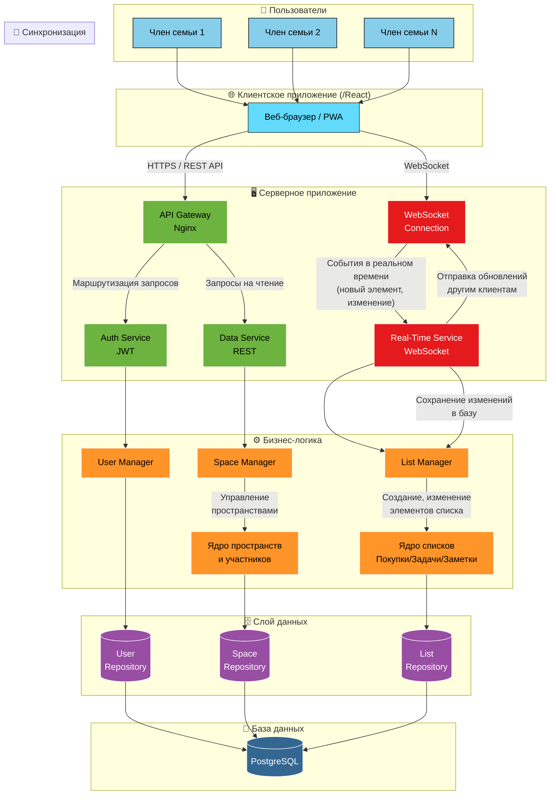

```mermaid
graph TB
    subgraph "👥 Пользователи"
        U1[Член семьи 1]
        U2[Член семьи 2]
        U3[Член семьи N]
    end

    %% ---------- Frontend (Клиент) ----------
    subgraph "🌐 Клиентское приложение (/React)"
        WEB[Веб-браузер / PWA]
    end

    U1 --> WEB
    U2 --> WEB
    U3 --> WEB

    %% ---------- Communication ----------
    WEB -->|HTTPS / REST API| API[API Gateway<br/>Nginx]
    WEB -->|WebSocket| WS[WebSocket<br/>Connection]

    %% ---------- Backend Services (Node.js + Express) ----------
    subgraph "🖥️ Серверное приложение"
        API -->|Маршрутизация запросов| AUTH[Auth Service<br/>JWT]
        API -->|"Запросы на чтение"| DATA[Data Service<br/>REST]
        
        WS -->|"События в реальном времени<br/>(новый элемент, изменение)"| RT[Real-Time Service<br/>WebSocket]
    end

    %% ---------- Core Logic ----------
    subgraph "⚙️ Бизнес-логика"
        AUTH --> UM[User Manager]
        DATA --> SM[Space Manager]
        RT --> LM[List Manager]
        
        LM -->|Создание, изменение<br/>элементов списка| LM_CORE[Ядро списков<br/>Покупки/Задачи/Заметки]
        SM -->|Управление<br/>пространствами| SM_CORE[Ядро пространств<br/>и участников]
    end

    %% ---------- Data Access ----------
    subgraph "🗄️ Слой данных"
        UM --> UREPO[(User<br/>Repository)]
        SM_CORE --> SPREPO[(Space<br/>Repository)]
        LM_CORE --> LREPO[(List<br/>Repository)]
    end

    %% ---------- Database ----------
    subgraph "💾 База данных"
        UREPO --> DB[(PostgreSQL<br/>)]
        SPREPO --> DB
        LREPO --> DB
    end

    %% ---------- Real-Time Sync ----------
    subgraph "🔄 Синхронизация"
        RT -->|"Отправка обновлений<br/>другим клиентам"| WS
        RT -->|"Сохранение изменений<br/>в базу"| LM
    end

    %% ---------- Стили для блоков ----------
    classDef users fill:#87CEEB,stroke:#000,color:#000;
    classDef frontend fill:#61dafb,stroke:#282c34,color:#000;
    classDef backend fill:#6db33f,stroke:#fff,color:#000;
    classDef logic fill:#ff9429,stroke:#fff,color:#000;
    classDef data fill:#984ea3,stroke:#fff,color:#fff;
    classDef database fill:#336791,stroke:#fff,color:#fff;
    classDef sync fill:#e41a1c,stroke:#fff,color:#fff;

    class U1,U2,U3 users;
    class WEB frontend;
    class API,WS,AUTH,DATA,RT backend;
    class UM,SM,LM,LM_CORE,SM_CORE logic;
    class UREPO,SPREPO,LREPO data;
    class DB database;
    class WS,RT sync;
```
